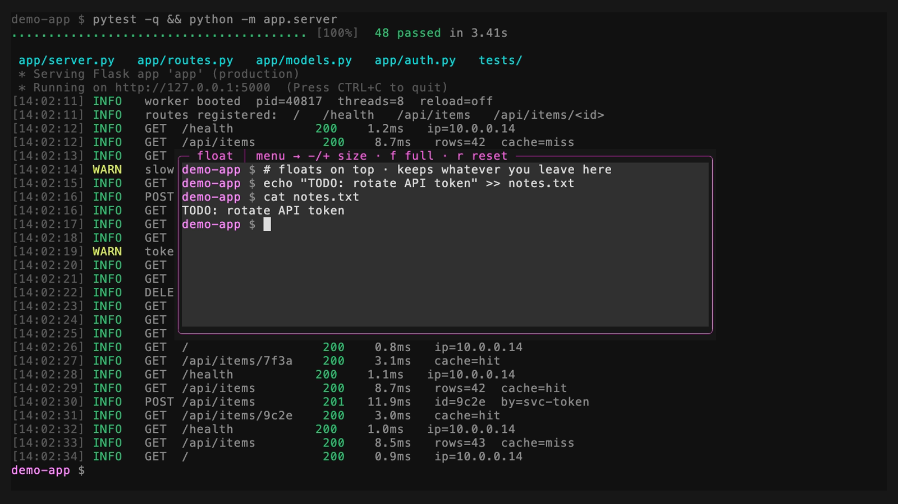

# tmux-floatpane 繁體中文說明

一個給 tmux 用的**浮動暫存終端機**。按一個鍵，一個小小的終端機視窗就會浮在你
目前畫面的正上方；再按一次就收起來，而且會記得你剛剛留在裡面的東西。



*按一個鍵，一個浮動的 `scratch` 終端機就浮在你的工作正上方——它是真正、會保留內容的 shell，你留在裡面的東西下次打開還在。*

> 誠實說明：這是
> [omerxx/tmux-floax](https://github.com/omerxx/tmux-floax)（GPL-3.0 授權）的
> **強化分支**。截至 2026-07，floax 約有 848 顆星，最後一次更新是 2026-02-24，
> 還有約 37 個未處理的問題——它是**半休眠、不是死掉**，目前仍可正常使用。這個
> 分支只是把我遇到的幾個具體 bug 修乾淨了。它**不是**「接班人」，也不對 floax
> 的未來下任何斷言。星數與問題數會變動，最新狀況請看上游 repo。

---

## 這是什麼？

你在終端機裡工作到一半，臨時需要一塊小空間——跑一個指令、查個東西、記個筆記、
玩一下 REPL——但你不想打亂目前的排版。

`tmux-floatpane` 就是給你這塊空間。按一個鍵，畫面正中央就浮出一個小視窗。它是
一個真正、會保留內容的終端機工作階段（名字叫 `scratch`），所以你留在裡面的東西
下次打開還在。再按一次鍵，它就藏起來。就這麼簡單。

你可以把它放大、縮小、切成全螢幕，或把一般視窗「丟進去 / 拉出來」——這些全都能
從一個小選單操作，不用記什麼奇怪的快捷鍵。

---

## 快速上手

你需要 **tmux 3.3 或更新版本**（輸入 `tmux -V` 查看）。下面兩條路擇一即可，結果
一樣：**按 `prefix` 再按 `t`** 就能開關浮動視窗。（`prefix` 是你的 tmux 前綴鍵，
沒改過的話是 `Ctrl-b`。）

### 路線 A — 我沒有用套件管理器（現在就能用）

把這三步複製貼到終端機：

```sh
# 1. 把外掛下載到一個固定的位置
git clone https://github.com/operonlab/tmux-floatpane ~/.tmux/plugins/tmux-floatpane

# 2. 叫 tmux 載入它——會在你的設定檔加一行
echo "run-shell ~/.tmux/plugins/tmux-floatpane/floatpane.tmux" >> ~/.tmux.conf

# 3. 重新載入 tmux 設定（在 tmux 裡按 prefix 再按 r，或執行下面這行）
tmux source-file ~/.tmux.conf
```

現在按 `prefix` `t`，完成。

### 路線 B — 我用 TPM（tmux 套件管理器）

**還沒裝 TPM 的話**，先裝（一行指令）：

```sh
git clone https://github.com/tmux-plugins/tpm ~/.tmux/plugins/tpm
```

並確認你 `~/.tmux.conf` 的最後一行是：

```tmux
run '~/.tmux/plugins/tpm/tpm'
```

**接著加入這個外掛。** 在 `~/.tmux.conf` 裡、上面那行 `run` 的**上方**加：

```tmux
set -g @plugin 'operonlab/tmux-floatpane'
```

重新載入設定（`prefix` `r`），再按 `prefix` `I`（大寫 i）讓 TPM 下載它。之後
`prefix` `t` 就能開關浮動視窗。

### 試試選單

按 `prefix` `P` 會打開一個小選單，可以縮小（`-`）、放大（`+`）、全螢幕（`f`）、
還原大小（`r`），或把視窗嵌回你原本的工作階段（`e`）。不用背任何組合鍵。

---

## 常見問題（FAQ）

**問：我按了 `prefix t` 卻沒反應。**
先確認你的前綴鍵（預設 `Ctrl-b`）。接著重新載入設定（`prefix` `r`），再檢查綁定
有沒有在：`tmux list-keys | grep floatpane`。如果是空的，代表外掛那行沒被載入——
路線 B 要確認它在 TPM `run` 那行的**上面**；路線 A 要確認 `run-shell` 的路徑正確。

**問：我把浮動視窗裡的 shell 關掉後，畫面跳到一個奇怪的工作階段。**
這正是這個分支特別修好的地方——浮動視窗會強制自己的工作階段用
`detach-on-destroy on`。如果你還是遇到，可能是載到舊版；請執行下面的移除步驟再
重新載入。

**問：`Ctrl-Alt-` 那組縮放快捷鍵完全沒反應。**
有些終端機（和多工器）不會照 tmux 預期的方式送出 `Alt`／`Meta` 鍵，那組鍵就會
變成死鍵。這是已知且正常的——直接用選單就好（`prefix` `P` → `-`／`+`／`f`）。你
也可以用 `set -g @floatpane-hotkeys off` 把那組快捷鍵整個關掉。

**問：浮動視窗開起來大小怪怪的／是舊的尺寸。**
打開選單（`prefix` `P`）選 **reset size**（`r`）。尺寸是每個執行中的 tmux server
各自記住的，tmux 重啟後會回到你設定的預設值。

**問：我可以把一般視窗放進浮動視窗、或再拿出來嗎？**
可以。在浮動視窗裡：選單 → **embed to session**，把目前視窗放回你剛才來的工作
階段。在一般視窗裡：選單 → **pop window out**，把它浮起來。

**問：為什麼按 `prefix` `t` 沒有跳出 tmux 內建的時鐘？**
`@floatpane-bind-toggle` 預設值是 `t`，會取代 tmux 內建的 `prefix` + `t`
時鐘顯示綁定。如果你想保留內建時鐘，改用別的鍵，例如
`set -g @floatpane-bind-toggle 'j'`。

---

## 完全移除

在一個已連上的 tmux client 執行：

```sh
bash ~/.tmux/plugins/tmux-floatpane/scripts/teardown.sh
```

然後把 `~/.tmux.conf` 裡的外掛那行刪掉（`run-shell ...floatpane.tmux` 或
`set -g @plugin 'operonlab/tmux-floatpane'`），再 `prefix` `r` 重新載入。移除
程序不會動你自己加的 `@floatpane-*` 設定行，那些要自己手動刪。

`scratch` 工作階段本身——以及你留在裡面的任何東西——移除程序**不會**殺掉，
這是刻意的，避免你的工作內容不見。想要完全清乾淨的話自己執行：

```sh
tmux kill-session -t scratch
```

---

## 一個提醒：兩個「全域快捷鍵」選項

`@floatpane-root-bind`（免前綴的開關鍵）和 `@floatpane-hotkeys` 的 `Ctrl-Alt-*`
鍵，都是以 **server 全域**方式綁定（`bind -n`），也就是說會套用到連到同一個 tmux
server 的**每一個** client。單一 client（最常見）完全沒差；但如果你同時開兩個
終端機連同一個 server，這些鍵可能會互相干擾。真的遇到問題，就設
`@floatpane-hotkeys off` 並讓 `@floatpane-root-bind` 留空——前綴鍵和選單本來就
能做到全部功能，不需要任何全域綁定。

完整選項表與英文說明見 [README.md](../README.md)。

<!-- family-section -->
---

## [operonlab](https://github.com/operonlab) tmux 外掛家族

一組小而專注的外掛，能組合成同一個駕駛艙。上面是原生 tmux **之前**，下面是整個家族 **之後**：


想用哪個就裝哪個：

| 外掛 | 加了什麼 |
|------|----------|
| [tmux-workdesk](https://github.com/operonlab/tmux-workdesk) | 一鍵 IDE ＋ tile/main 窗格佈局 |
| **tmux-floatpane　—— 你在這** | 彈出式浮動暫存終端機 |
| [tmux-context-menu](https://github.com/operonlab/tmux-context-menu) | 右鍵／prefix 窗格動作選單 |
| [tmux-autosize](https://github.com/operonlab/tmux-autosize) | 背景視窗自動貼合用戶端尺寸 |
| [tmux-passthrough](https://github.com/operonlab/tmux-passthrough) | 把按鍵直接穿透給內層程式 |
| [tmux-sysmon](https://github.com/operonlab/tmux-sysmon) | 即時 CPU／MEM／DISK／NET 膠囊 |
| [tmux-llm-usage](https://github.com/operonlab/tmux-llm-usage) | LLM 配額／花費狀態膠囊 |
| [tmux-agent-status](https://github.com/operonlab/tmux-agent-status) | AI 窗格 busy／blocked／idle 膠囊 |
| [tmux-pillbar](https://github.com/operonlab/tmux-pillbar) | 打造第二列自訂 pill 狀態列 |
| [tmux-agent-resume](https://github.com/operonlab/tmux-agent-resume) | 崩潰後把每個 AI CLI 還原到原 session |
